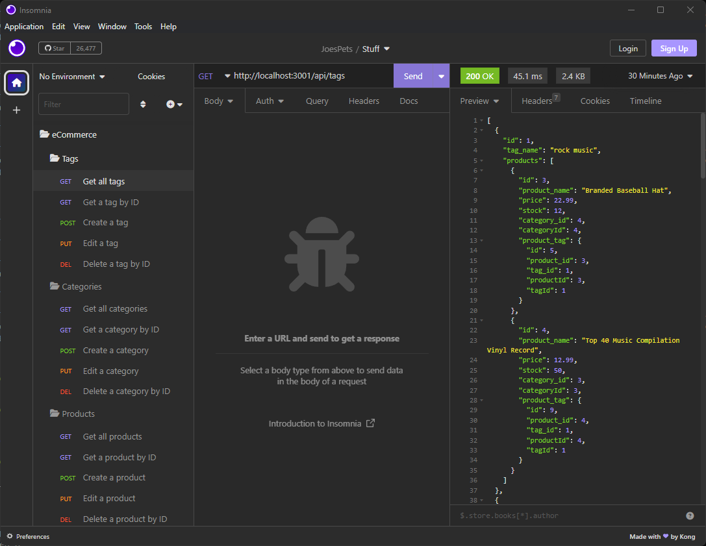

# ORM_ECommerce

## Description

This project uses Express.js, Node.js, dotenv.js, MySQL2.js, and Sequelize.js to implement an Express.js server that uses CRUD functions to service a MySQL database containing product data. It is meant to serve as an e-Commerce analog in order to learn how to use the MVC & ORM patterns in a production setting.

## Table of Contents (Optional)

- [Installation](#installation)
- [Usage](#usage)
- [Credits](#credits)
- [License](#license)

## Installation
This project requires a working MySQL server.

At the command prompt, clone the repository by typing:
```
git clone git@github.com:error201/ORM_ECommerce.git
``` 
Navigate into the new folder and install the necessary npm packages by typing:
```
npm install
```
Enter your MySQL shell and run the `schema.sql` file to set up the MySQL database by typing:
```
SOURCE schema.js
```
When the database has been created, seed the database tables by navigating to the root folder and typing:
```
npm run seed
```
If no errors are found, start the Express.js server by typing:
```
npm run start
```


## Usage

This project currently has no front-end, so all requests will have to be made to the server with a tester that can simulate HTTP requests. For this project, I used [Insomnia](https://insomnia.rest).




All requests follow the following format(s):
 - Products:
    - Get all Products:    `GET: http://localhost:3001/api/products/`
    - Get a Product by ID: `GET: http://localhost:3001/api/products/[product_id]`
    - Create a Product: `POST: http://localhost:3001/api/products/`
        - The JSON request body will take the form:
        ```
        {
            "product_name": "Basketball",
            "price": 200.00,
            "stock": 3,
            "tagIds": [1, 2, 3, 4]
        }  
        ```
    - Edit a product: `PUT: http://localhost:3001/api/products/[product_id]`
    - Delete a product: `DELETE: http://localhost:3001/api/products/[product_id]`

 - Categories:
    - Get all Categories:    `GET: http://localhost:3001/api/categories/`
    - Get a Category by ID: `GET: http://localhost:3001/api/categories/[category_id]`
    - Create a Category: `POST: http://localhost:3001/api/categories/`
        - The JSON request body will take the form:
        ```
        {
            "category_name": "Ties",
        }  
        ```
    - Edit a Category: `PUT: http://localhost:3001/api/categories/[category_id]`
    - Delete a Category: `DELETE: http://localhost:3001/api/categories/[category_id]`

 - Tags:
    - Get all Tags:    `GET: http://localhost:3001/api/tags/`
    - Get a Tag by ID: `GET: http://localhost:3001/api/tags/[tag_id]`
    - Create a Tag: `POST: http://localhost:3001/api/tags/`
        - The JSON request body will take the form:
        ```
        {
            "tag_name": "Ties",
        }  
        ```
    - Edit a Tag: `PUT: http://localhost:3001/api/tags/[tag_id]`
    - Delete a tag: `DELETE: http://localhost:3001/api/tags/[tag_id]`


## Credits

Several packages and/or libraries were used for this project:
 - [Node.js](https://nodejs.org/en/)
 - [mysql2](https://www.npmjs.com/package/mysql2)
 - [Express.js](https://expressjs.com/)
 - [MySQL2](https://www.npmjs.com/package/mysql2)
 - [Sequelize](https://sequelize.org/)
 - [Dotenv](https://www.npmjs.com/package/dotenv)

## License

This project is covered by the MIT license. Please see [LICENSE](./LICENSE) for details.


---

## Badges


## How to Contribute

Feel free to fork and/or clone this repository to contribute.
